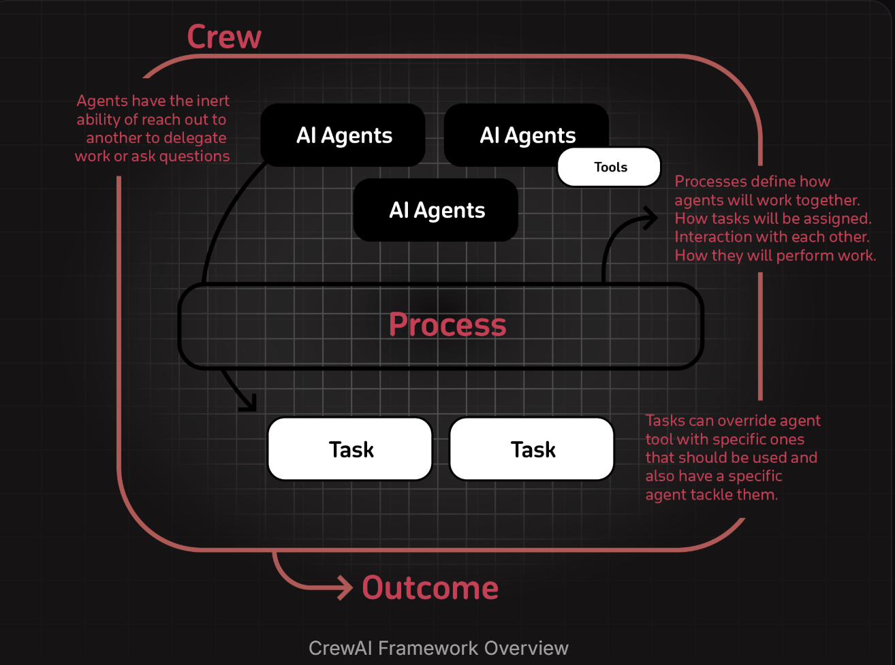
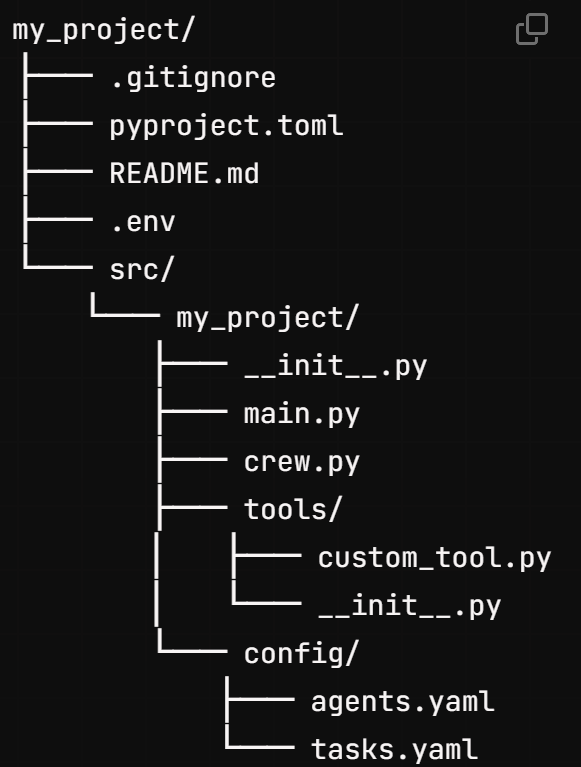

# **Introduction**

- **Overview of CrewAI**: 

Orchestrating autonomous AI agents, lets us create AI teams where each agent has specific roles, tools, and goals, working together to accomplish complex tasks.


# **How It All Works Together**

1. The **Crew** organizes the overall operation
2. **AI Agents** work on their specialized tasks
3. The **Process** ensures smooth collaboration
4. **Tasks** get completed to achieve the goal

# **Key Features**

- **Role-Based Agent Design**: Think of an agent as a specialized team member with specific skills, expertise, and responsibilities. For example, a Researcher agent might excel at gathering and analyzing information, while a Writer agent might be better at creating content.

- **Autonomous Collaboration /Intelligent Collaboration** :A crew in crewAI represents a collaborative group of agents working together to achieve a set of tasks. Each crew defines the strategy for task execution, agent collaboration, and the overall workflow.

- **Integration Capabilities**: Compatibility with various tools and platforms, facilitating seamless integration into existing workflows.Can craft custom tools tailored for their agent’s needs or utilize pre-built options.

# ***Installation***

CrewAI requires Python >=3.10 and <3.13.

**Installing CrewAI**

```powershell
pip install 'crewai[tools]'
```
**Creating a New Project**
```powershell
crewai create crew my_project
```
This creates a new project with the following structure:




# **Quick Start**
Create your crew (Do not If Already created)

```powershell
crewai create crew latest-ai-development
```
**Modify Your Agents.yaml and Tasks.yaml file according to your project Requirements**

You can also modify the agents and tasks as needed to fit your use case or copy and paste as is to your project. Any variable interpolated in your agents.yaml and tasks.yaml files like {topic} will be replaced by the value of the variable in the main.py file.

**Modify your `crew.py` file**
 ```python
# src/latest_ai_development/crew.py
from crewai import Agent, Crew, Process, Task
from crewai.project import CrewBase, agent, crew, task
from crewai_tools import SerperDevTool

@CrewBase
class LatestAiDevelopmentCrew():
  """LatestAiDevelopment crew"""

  @agent
  def researcher(self) -> Agent:
    return Agent(
      config=self.agents_config['researcher'],
      verbose=True,
      tools=[SerperDevTool()]
    )

  @agent
  def reporting_analyst(self) -> Agent:
    return Agent(
      config=self.agents_config['reporting_analyst'],
      verbose=True
    )

  @task
  def research_task(self) -> Task:
    return Task(
      config=self.tasks_config['research_task'],
    )

  @task
  def reporting_task(self) -> Task:
    return Task(
      config=self.tasks_config['reporting_task'],
      output_file='output/report.md' # This is the file that will be contain the final report.
    )

  @crew
  def crew(self) -> Crew:
    """Creates the LatestAiDevelopment crew"""
    return Crew(
      agents=self.agents, # Automatically created by the @agent decorator
      tasks=self.tasks, # Automatically created by the @task decorator
      process=Process.sequential,
      verbose=True,
    )

```
**Feel free to pass custom inputs to your crew**

```python
#!/usr/bin/env python
# src/latest_ai_development/main.py
import sys
from latest_ai_development.crew import LatestAiDevelopmentCrew

def run():
  """
  Run the crew.
  """
  inputs = {
    'topic': 'AI Agents'
  }
  LatestAiDevelopmentCrew().crew().kickoff(inputs=inputs)

```
**Lock and install the dependencies (Imp)**
```powershell
cd latest-ai-development

crewai install
```

**Run your crew**

```powershell
Run your crew
```

**Your final report**

You should see the output in the console and the **report.md** file should be created in the root of your project with the final report.
